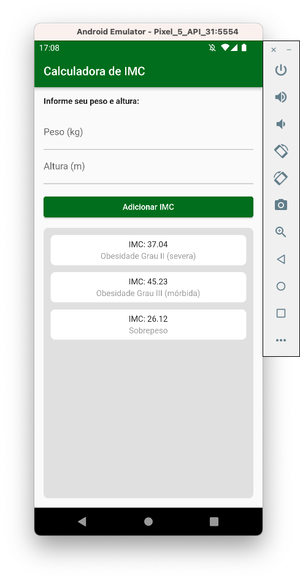

# Calculadora de IMC - Projeto Dio Flutter Specialist

## Funcionalidades

Este projeto foi elaborado durante o curso Flutter Specialist da Dio. O objetivo é criar um layout para ajudar o usuário a obter seu Íncide de Massa Corpórea - IMC, e adicionar o resultado em uma lista.

## Execução
Segue abaixo um print do app em funcionamento
